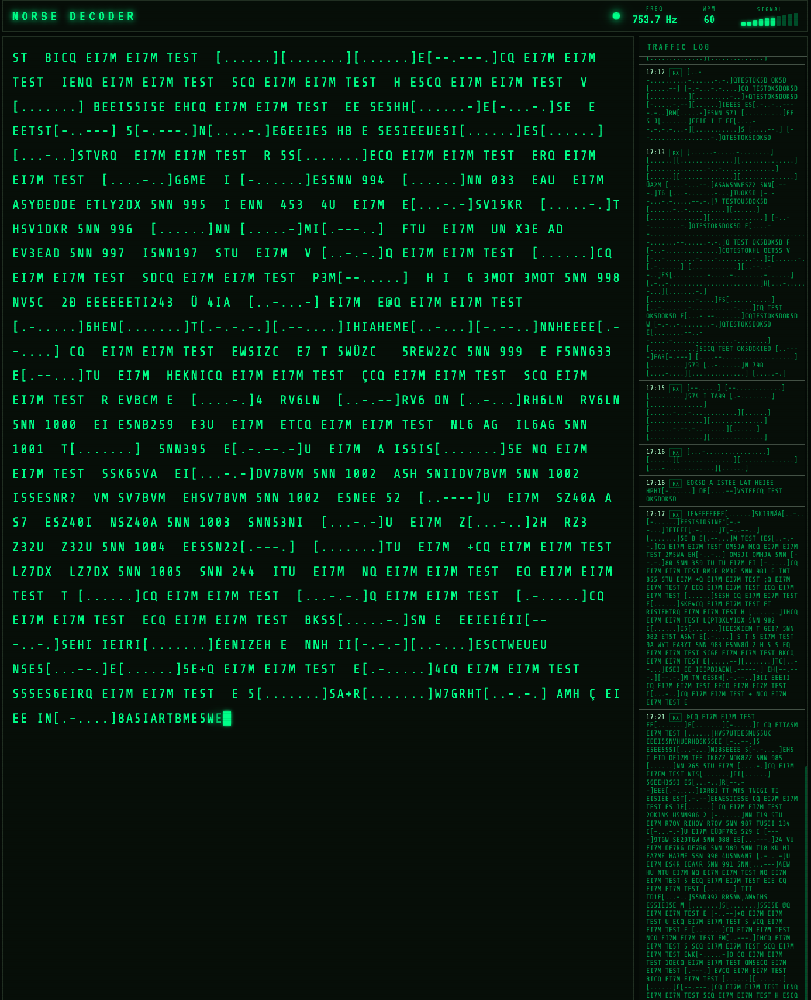

# Morse Code Decoder

An open source CW (Morse code) decoder built in Python. Listens to audio from any source — a real radio, an RTL-SDR, or a browser-based WebSDR — decodes the Morse in real time, and displays the text in a web UI with a traffic log.

Built as a learning project. The code is intentionally readable and well-commented so you can understand how it works and modify it.



---

## Features

- **Real-time decoding** via a clean phosphor-terminal web interface
- **Adaptive tone detection** using the Goertzel algorithm — works regardless of signal strength, no manual threshold tuning needed
- **Adaptive timing** — automatically learns the operator's speed (5–40+ WPM) from the first few marks, no WPM setting required
- **European character support** — Ä, Ö, Ü, É, À, Ç
- **Traffic log** — all decoded sessions saved as JSON Lines files, one per day
- **Home Assistant integration** — optional MQTT publish for automations, dashboards, and notifications
- **Pluggable audio sources** — system audio, RTL-SDR, or WAV file playback
- **No hardware required to start** — test using a WebSDR in your browser

---

## Requirements

- Mac or Linux (Windows works via WSL2)
- Python 3.10+
- For RTL-SDR: RTL-SDR V4 hardware + `librtlsdr`
- For browser testing: BlackHole virtual audio cable (Mac)

---

## Quick Start (Mac)

```bash
git clone https://github.com/yourname/morse-decoder
cd morse-decoder
chmod +x setup_mac.sh
./setup_mac.sh
```

The setup script installs Homebrew (if needed), `librtlsdr`, BlackHole virtual audio, and all Python dependencies into a virtual environment. It prints full testing instructions when it finishes.

Then activate the environment and run:

```bash
source venv/bin/activate
python main.py --device 'BlackHole 2ch' --port 5001
```

Open `http://localhost:5001` in your browser.

---

## Testing Without Hardware (WebSDR Method)

You can decode real live amateur radio traffic without any hardware using a browser-based WebSDR and a virtual audio cable.

**1. Install BlackHole** (done by `setup_mac.sh`, or manually):
```bash
brew install --cask blackhole-2ch
```

**2. Create a Multi-Output Device in Audio MIDI Setup:**
- Open `Applications > Utilities > Audio MIDI Setup`
- Click `+` → `Create Multi-Output Device`
- Check both `BlackHole 2ch` and `Built-in Output` (so you can still hear it)
- Right-click the device → `Use This Device for Sound Output`

**3. Open a WebSDR in your browser:**
- [websdr.ewi.utwente.nl](http://websdr.ewi.utwente.nl:8901) — University of Twente, Netherlands
- Tune to **7.025–7.030 MHz**, mode **CW**
- Set filter to **0.14 kHz** (click "narrower" until it reads 0.14)
- Click on a single isolated signal in the waterfall

**4. Run the decoder:**
```bash
python main.py --device 'BlackHole 2ch' --port 5001
```

**Tips for finding a good signal:**
- Look for a bright vertical line in the waterfall with clear dark space on both sides
- Avoid clusters of overlapping signals
- Aim for a station that sounds slow enough to almost count the dots by ear (~15–25 WPM is ideal for testing)
- 40m (7 MHz) is most active evenings in Europe/East Coast US; 20m (14 MHz) is good during the day

---

## Usage

```
python main.py [options]

Options:
  --source {audio,sdr}        Input source (default: audio)
  --device DEVICE             Audio device name or index (use --list to see options)
  --freq FREQ                 RTL-SDR frequency in MHz (default: 7.050)
  --list                      List available audio input devices
  --port PORT                 Web UI port (default: 5000)
  --log-dir LOG_DIR           Directory for log files (default: ./logs)
  --mqtt-host HOST            MQTT broker for Home Assistant integration
  --mqtt-port PORT            MQTT broker port (default: 1883)
```

**Common invocations:**

```bash
# List audio devices
python main.py --list

# Use BlackHole (WebSDR browser audio)
python main.py --device 'BlackHole 2ch' --port 5001

# Use built-in mic (hold phone near radio speaker)
python main.py --device 'MacBook Pro Microphone'

# RTL-SDR on 40m CW
python main.py --source sdr --freq 7.050

# RTL-SDR with Home Assistant MQTT
python main.py --source sdr --freq 7.050 --mqtt-host 192.168.1.100
```

---

## RTL-SDR Setup

When your hardware arrives:

```bash
# Install driver (already done by setup_mac.sh)
brew install librtlsdr

# Run on 40m CW calling frequency
python main.py --source sdr --freq 7.050
```

Recommended hardware: **RTL-SDR V4** (~$35 from rtl-sdr.com). The V4 has built-in HF direct sampling — no upconverter needed to receive the HF ham bands.

Good starting frequencies for CW:

| Band | Frequency | Notes |
|------|-----------|-------|
| 40m  | 7.000–7.125 MHz | Most active, especially evenings |
| 20m  | 14.000–14.150 MHz | International, busy daytime |
| 30m  | 10.100–10.150 MHz | CW-only band, quieter |
| 80m  | 3.500–3.600 MHz | Good at night |

---

## Home Assistant Integration

The decoder publishes to MQTT when `--mqtt-host` is set:

| Topic | Content |
|-------|---------|
| `morse/rx/char` | Each decoded character as it arrives |
| `morse/rx/message` | Complete message after silence (JSON) |

Add to `configuration.yaml`:

```yaml
mqtt:
  sensor:
    - name: "Morse RX"
      state_topic: "morse/rx/char"

    - name: "Morse Last Message"
      state_topic: "morse/rx/message"
      value_template: "{{ value_json.text }}"
```

Traffic logs are also saved as JSON Lines files in `./logs/YYYY-MM-DD.jsonl`, which Home Assistant can read directly via a file sensor.

---

## Project Structure

```
morse-decoder/
├── main.py                 # Entry point and CLI
├── requirements.txt
├── setup_mac.sh            # One-command Mac setup
├── src/
│   ├── audio_source.py     # Pluggable audio inputs (system audio, RTL-SDR, file)
│   ├── decoder.py          # Tone detection (Goertzel) + timing decoder
│   ├── logger.py           # JSON Lines traffic logger
│   └── morse_table.py      # ITU Morse code table including European characters
└── web/
    ├── app.py              # Flask + Socket.IO server
    └── templates/
        └── index.html      # Phosphor terminal web UI
```

### How It Works

**Stage 1 — Tone Detection** (`ToneDetector` in `decoder.py`)

Uses the [Goertzel algorithm](https://en.wikipedia.org/wiki/Goertzel_algorithm) to measure power at a single frequency efficiently. An adaptive threshold based on the recent history of signal levels distinguishes key-down from key-up — this works regardless of signal strength because it's relative to the signal's own dynamics.

Every ~40 chunks, a full FFT scan updates the detected frequency, so the decoder auto-tunes to whatever CW tone is present in the passband (typically 400–1200 Hz).

**Stage 2 — Timing Decoder** (`TimingDecoder` in `decoder.py`)

Converts key-up/key-down transitions into dots, dashes, and spaces using ITU timing ratios (dit : dah : letter space : word space = 1 : 3 : 3 : 7).

The dit duration is learned automatically using a bootstrap phase: the first 10 marks are collected and analyzed with a two-pass gap detection algorithm to separate dits from dahs and set the initial timing estimate. After that, an asymmetric EWMA keeps the estimate stable — slow to drift upward (noise resistance) and faster to come down (handles operators who speed up).

---

## Contributing

Pull requests welcome. Some ideas for improvements:

- **Noise gate** — suppress decoding during silence between transmissions
- **Callsign detection** — highlight recognised callsign patterns in the UI
- **Raspberry Pi Zero 2 W deployment** — carrier board, OLED display, GPIO keyer output
- **TX path** — USB keyboard → Morse → GPIO optoisolator for transmitting (requires amateur license)
- **Band scanner** — sweep across CW portions and log active frequencies
- **Farnsworth timing support** — handle operators who use stretched letter spacing at higher element speeds

---

## License

MIT — do whatever you like with it, but a callsign mention in your QRZ page would be appreciated.

---

## Acknowledgements

Tested live against the CQ WPX CW Contest, May 2026. Stations decoded include EI7M (Ireland), OK5D (Czech Republic), TM1A (France), UX2HB (Ukraine), LY1M (Lithuania), RM3F (Russia), and others. Not bad for a first afternoon.

73 de your-callsign-here
